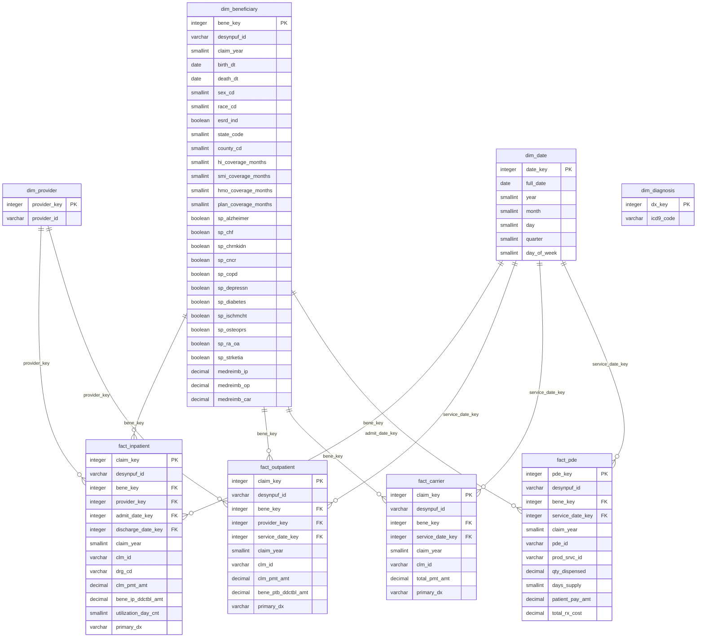

# Entity-Relationship Diagram — CMS Claims Star Schema

Star schema centered on Medicare claim events. Fact tables reference dimension
tables via surrogate integer keys. `dim_beneficiary` is SCD-lite: one row per
beneficiary per calendar year. `fact_claim_line` is a UNION ALL view across all
four fact tables for cross-cutting analytics.

